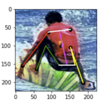

# Implementation of [Deep Pose](https://openaccess.thecvf.com/content_cvpr_2014/papers/Toshev_DeepPose_Human_Pose_2014_CVPR_paper.pdf)

# Introduction
This repository contains an implementation of stage one of the Deep Pose. This network was proposed by ‪Alexander Toshev et al. in 2014 as one of the first deep learning approaches to human pose estimation. We (my partner Ashwin Gupta and myself) perform this implementation utilizing the Microsoft Common Objects in Context (COCO) dataset. This work was completed as the final project of a graduate course in computer vision at the University of Michigan in 2021. 

# Human Pose Estimation
Human Pose Estimation identifies and classifies the poses of human body parts and joints in images, videos, or through other computer vision input sources. In general, pose estimation is used to represent and infer human body poses in 2D and/or 3D space. Below is an example image (taken from this project) where a person has had their joints labelled and represented in a way that is easy to visualize.

# Deep Pose Model

# Implementation Details

# Utilization of this Repository
